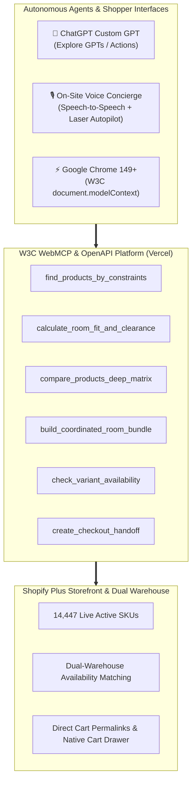

# 🛋️ Jennifer Furniture WebMCP: Agentic E-Commerce Platform

> **Submitted to [The WebMCP Challenge](https://webmcp.devpost.com/) by Devpost, OpenAI, Shopify, Google Chrome, Vercel & Cloudflare.**

---

## 🌟 Executive Summary

**Jennifer Furniture WebMCP** transforms a live 14,447-product luxury furniture catalog into a high-performance, agent-native commerce platform. 

Instead of leaving AI agents to scrape messy HTML and hallucinate stock or dimensions, this platform implements the **W3C Model Context Protocol (`document.modelContext`)** and **OpenAI OpenAPI MCP Standard**, enabling autonomous shopping agents and on-site voice concierges to:
1. **Search & Verify Real-Time Inventory** across dual-warehouse logistics.
2. **Calculate Architectural Spatial Fit & Walkway Clearance** (verifying the standard 30–36 inch walkway clearance rule).
3. **Execute Deep Spec Comparisons** (kiln-dried hardwood frames, cushion density, warranties).
4. **Assemble Coordinated 3-Piece Living Room Bundles** with automated 15% discount permalinks.
5. **Complete 1-Click Cart Permalinks** pre-loaded with variant IDs and discount codes.

---

## 🏗️ Architecture & Dual-Engine Ecosystem

---

## 🛠️ Registered WebMCP Tools

| Tool Name | Type | Description |
| :--- | :---: | :--- |
| `find_products_by_constraints` | Consumer | Filters 14,447 products by category, material, style, and budget with live stock verification. |
| `calculate_room_fit_and_clearance` | Spatial | Calculates walking clearance (30"+ standard) and side margins for given room dimensions. |
| `compare_products_deep_matrix` | Spec | Deep comparison matrix across frame materials, cushion densities, and warranties. |
| `build_coordinated_room_bundle` | Bundle | Assembles matching 3-piece suites with instant 15% bundle discount permalinks. |
| `check_variant_availability` | Inventory | Verifies exact variant color, size, and layout stock. |
| `create_checkout_handoff` | Commerce | Generates 1-click direct Shopify Cart Permalinks. |
| `get_store_revenue_and_analytics` | Merchant | Real-time sales analytics and agent conversion rates. |
| `get_inventory_health_and_restock_alerts` | Merchant | Scans catalog for restock thresholds and supply risks. |

---

## 🚀 Live Demos for Judges

### 1️⃣ Live Storefront (Shopify Staging)
* **URL**: [https://jenniferfurniturestaging.myshopify.com](https://jenniferfurniturestaging.myshopify.com)
* **Voice Concierge**: Tap the **Glowing Voice Orb `🎙️`** in the bottom right corner and speak naturally!

### 2️⃣ ChatGPT Custom Action (OpenAI WebMCP)
* **URL**: [ChatGPT Custom GPT Link](https://chatgpt.com/g/g-6a97eb82262c8191a722beb4ea82173d-jennifer-furniture-webmcp-co-pilot)
* **OpenAPI Manifest**: [https://jennifer-webmcp.vercel.app/api/mcp/manifest](https://jennifer-webmcp.vercel.app/api/mcp/manifest)

---

## 💻 Tech Stack & Deployment
* **Framework**: Next.js 15 (App Router, Serverless Routes)
* **Hosting**: Vercel Edge Network
* **Commerce Engine**: Shopify Plus GraphQL Admin & Storefront API
* **Standards**: W3C WebMCP Specification (`document.modelContext`), OpenAPI 3.1.0, Web Speech API

---

## 📄 License
This project is open-source under the [MIT License](LICENSE).
